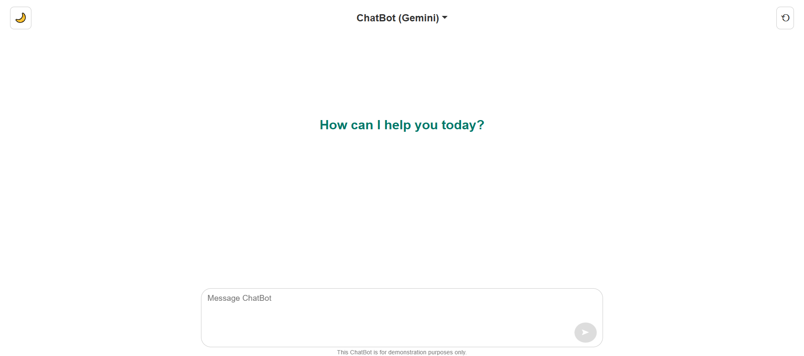

# ChatBot

A simple web-based ChatBot interface built with HTML, CSS, and JavaScript. This project demonstrates a basic chatbot framework with customizable logic.



## Features
- **Responsive Design**: Works on both desktop and mobile devices.
- **Markdown Support**: Uses `markdown-it` to render Markdown-formatted responses.
- **Model Selection**: Switch between Gemini and Groq AI models.
- **Dark Mode Toggle**: Allows users to switch between light and dark themes.
- **Reset Chat**: Clears the conversation with a single click.
- **Dynamic Input Area**: Adjusts the textarea height based on user input.

## Technologies Used
- **HTML5**: Structure of the web page.
- **CSS3**: Styling and layout.
- **JavaScript**: Chatbot logic and interactivity.
- **Bootstrap**: Responsive design and pre-built components.
- **jQuery**: Simplified DOM manipulation.
- **Markdown-it**: Markdown rendering for chatbot responses.

## Setup Instructions

### Prerequisites
- A modern web browser (e.g., Chrome, Firefox, Edge).
- Basic knowledge of HTML, CSS, and JavaScript.

### Steps to Run the Project
1. **Clone the Repository**:
   ```bash
   git clone https://github.com/jomadlcrz/ChatBot.git
   cd ChatBot
   ```

2. **Open the Project**:
   - Open the `index.html` file in your browser.

3. **Customize the ChatBot**:
   - Modify the `script.js` file to add your chatbot logic.
   - Update the `style.css` file to customize the appearance.

4. **Run Locally**:
   - If you have a local server (e.g., `http-server` or `live-server`), serve the project for better testing:
     ```bash
     npx http-server
     ```

## File Structure
```
ChatBot/
├── index.html          # Main HTML file
├── style.css           # Custom CSS styles
├── script.js           # JavaScript logic for the chatbot
├── images/             # Folder for images (e.g., favicon, screenshots)
│   └── favicon.ico     # Favicon for the website
├── README.md           # Project documentation
```

## How It Works
1. The user types a message in the input area and clicks send (or presses Enter).
2. The message appears in the chat box.
3. The chatbot processes the input and responds.
4. Users can switch between AI models (Gemini/Groq) via the dropdown.
5. The chat can be reset using the reset icon (⟲).

## Customization
- **Add ChatBot Logic**: Update `script.js` to integrate an AI API or custom chatbot logic.
- **Change Styling**: Modify `style.css` to personalize the UI.
- **Update Favicon**: Replace `images/favicon.ico` with your own icon.

## License
This project is open-source and available under the [MIT License](LICENSE).

## Disclaimer
This ChatBot is for demonstration purposes only and does not include advanced AI or NLP capabilities.